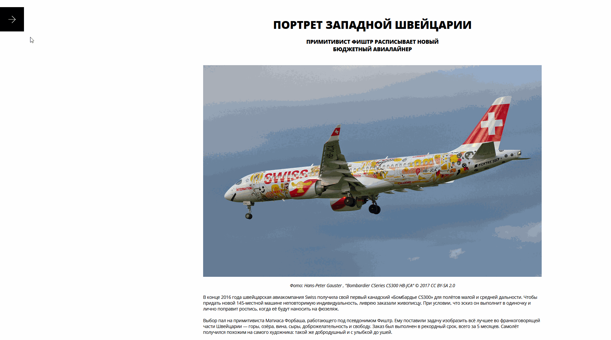

<h1 align="center">Проектная работа "Blog-customizer" by Cryoph0enix</h1>

**В ходе этой проектной работы реализована кастомизация страницы блога через открывающуюся панель, которая позволяет изменить:**

- ширину блога;
- шрифт текста;
- цвета фона и текста;
- шрифт текста.

---

<h2 align="center">Превью проекта</h2>


**Превью функциональных возможностей**


---

<h3 align="center">Реализованные фукциональные возможности</h3>

1. При нажатии на «стрелку» открывается сайдбар с настройками, при повторном нажатии или клике вне сайдбар закрывается.
2. При изменении настроек в сайдбаре они не применяются сразу.
3. После нажатия на «применить» стили применяются к статье.
4. При нажатии «сбросить» настройки в форме сбрасываются на начальные, которые были при открытии страницы, и стили применяются к статье.
5. Настройки устанавливаются через CSS-переменные, которые уже есть в стилях и установлены в коде в дефолтные значения.

---

<h3 align="center">Используемые технологии:</h3>
- Стек - HTML, SCSS, TypeScript, React;
- Сборка - Webpack.

---

<h3 align="center">Сборка и запуск</h3>

Для запуска Storybook выполните:

```
npm run storybook
```

Для запуска линтера для стилей выполните:

```
npm run stylelint
```

Для запуска линтера выполните:

```
npm run lint
```

Для запуска форматтера выполните:

```
npm run format
```

Для сборки и запуска проекта выполните:

```
npm run build
npm start
```
